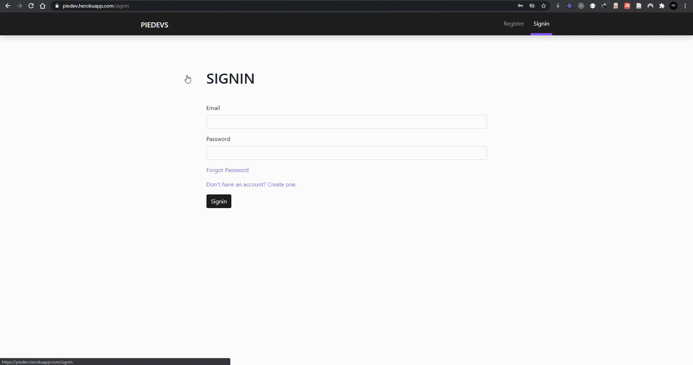

<p align="center">
    
    <br>
<h3 align='center'>
    A Full MERN Stack Authentication Web
</h3>
<p align='center'>
    <a href="https://github.com/othneildrew/Best-README-Template"><strong>Explore the docs »</strong></a>
</p>
<p align="center">
    <strong>Live Demo:</strong>
    <a href='https://piedev.herokuapp.com'>piedev.herokuapp.com</a>
</p>
</>

#
## About App
A mern stack authentication system featuring tons errors handling, form validation with transactional email sending e.g: account activation, password reset link, and protecting routes and AppBar.

**Features and Errors handling**

- 100% Responsive with nice a drawer and little animation
- Form Validation
- Create user
- Sending email verification link
- Resend Verification Link
- Protecting **root** `/` route from unverified email
- Protecting **root** `/` router if user not signed in
- Controlling signin state `httpOnly` cookie
- Sending forget password link and updating

> **You may get emails on spam folder as the SMTP only for served for demo purpose**
#
### Built With
- [**Express**](https://expressjs.com/)
- [**MongoDB**](https://www.mongodb.com/)
- [**React**](https://reactjs.org/)
- [**jwt**](https://jwt.io/)
- [**react-hook-form**](https://react-hook-form.com/)
- [**Node Mailer**](https://nodemailer.com/about/)

### Getting Started
1. **npm** or **yarn**. I prefer `yarn`.
    <br>
    ```
    npm install npm@latest -g
    npm install --global yarn
    ```
2. Clone the repo
    <br>
    ```
    git clone https://github.com/pieeee/MERN-Stack-Authentication.git
    ```
3. Navigate to `server` folder and install dependencies via `yarn` or `npm install`.
<br>
4.  Navigate to `client` folder and install dependencies via `yarn` or `npm install`.
<br>
5.  Find the `.env.local` in `server` directory and fill it with your variables.
<br>
    ```
    JWT_SECRET =
    MONGO_URI =
    SMTP_USER =
    SMTP_PASS =
    NODE_ENV =
    ```
6. On ther server directory run `yarn dev` to start server on `http://locahost:4000` in the development mode.
   <br>
7. On ther client directory run `yarn start` to run application on `http://locahost:3000` in the development mode.

### App Structure

**Client**
```mern-auth-dev
┣ client
┃ ┣ src
┃ ┃ ┣ Assets
┃ ┃ ┣ Components
┃ ┃ ┃ ┣ Errors
┃ ┃ ┣ Config
┃ ┃ ┣ Helpers
┃ ┃ ┣ Pages
┃ ┃ ┃ ┣ ForgotPass.js
┃ ┃ ┃ ┣ Home.js
┃ ┃ ┃ ┣ Register.js
┃ ┃ ┃ ┗ Signin.js
┃ ┃ ┣ Utils
┃ ┃ ┣ App.js
┃ ┃ ┣ Custom.scss
┃ ┃ ┣ index.js
┃ ┣ package.json
```
**Server**
```
┣ server
┃ ┣ src
┃ ┃ ┣ configs
┃ ┃ ┣ resources
┃ ┃ ┃ ┗ users
┃ ┃ ┃ ┃ ┣ user.model.js
┃ ┃ ┃ ┃ ┗ user.router.js
┃ ┃ ┣ utils
┃ ┃ ┃ ┣ emails
┃ ┃ ┃ ┃ ┣ views
┃ ┃ ┃ ┃ ┗ index.js
┃ ┃ ┃ ┗ auth.js
┃ ┃ ┣ index.js
┃ ┃ ┗ server.js
┃ ┣ .babelrc
┃ ┣ package.json
```
<!-- CONTRIBUTING -->
### Contributing

Contributions are what make the open source community such an amazing place to be learn, inspire, and create. Any contributions you make are **greatly appreciated**.

1. Fork the Project
2. Create your Feature Branch 
3. Commit your Changes 
4. Push to the Branch
5. Open a Pull Request
6. Review and Help me to refactoring code.

### License

Distributed under the MIT License. See `LICENSE` for more information.

### Contact
Email: [info@piedev.tech]() 
Project Link: [MERN-Stack-Authentication](https://github.com/pieeee/MERN-Stack-Authentication)
